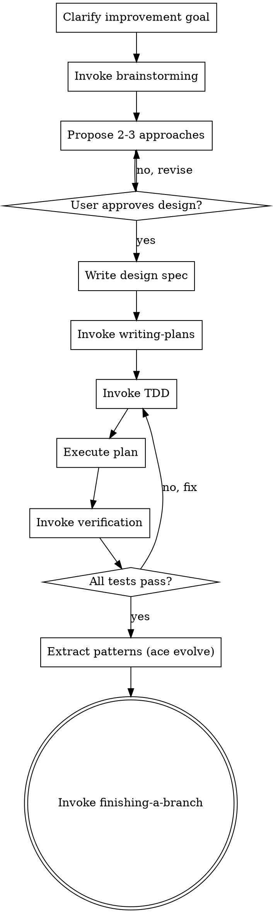

# ACE Paradigm 3 - ACE Development

Improve ACE framework using official superpowers skills, with ACE evolution闭环.

## When to Use

- User wants to improve ACE core (evolution/, composition/, workflow/)
- User wants to add new /ace:* commands
- User wants to enhance node/workflow framework
- User is modifying ACE source code
- Task targets ACE framework itself, not user workflows/devices

## Anti-Pattern: "Skip Design and Start Coding"

Every ACE framework change requires full Clarify → Design → Plan → Execute → Verify → Evolution → Complete cycle. Even "simple" command additions or bug fixes can have cascading effects on the framework. The design can be concise for well-understood changes, but you MUST complete all phases and get user approval before writing any framework code.

## Checklist

You MUST create a task for each of these items and complete them in order:

1. **Clarify improvement goal** — what part of ACE, constraints, breaking changes
2. **Invoke superpowers:brainstorming** — explore context, propose 2-3 approaches
3. **Get user approval on design** — wait for explicit confirmation
4. **Write design spec** — `docs/superpowers/specs/YYYY-MM-DD-<feature>-design.md`
5. **Invoke superpowers:writing-plans** — create implementation plan
6. **Invoke superpowers:test-driven-development** — RED: test → GREEN: code → REFACTOR: clean
7. **Execute plan** — invoke `superpowers:executing-plans` or `superpowers:subagent-driven-development`
8. **Invoke superpowers:verification-before-completion** — all tests pass, no regressions
9. **Extract patterns** — `ace evolve` for framework insights
10. **Invoke superpowers:finishing-a-development-branch** — merge/PR/cleanup

## Process Flow



**The terminal state is invoking finishing-a-development-branch.** Do NOT skip TDD or verification phases. All framework changes must have tests that fail first, then pass.

## Workflow

### Phase 1: Clarify

Understand development goals:
1. What part of ACE framework to improve?
2. What are the constraints and success criteria?
3. Any breaking changes to consider?

### Phase 2: Design (Superpowers)

**Invoke superpowers:brainstorming**
- Explore project context (ACE codebase)
- Ask clarifying questions
- Propose 2-3 approaches
- Present design sections
- Get user approval
- Write spec to `docs/superpowers/specs/YYYY-MM-DD-<feature>-design.md`

### Phase 3: Plan (Superpowers)

**Invoke superpowers:writing-plans**
- Create implementation plan
- Bite-sized tasks (2-5 min each)
- Exact file paths, complete code, test commands
- Save to `docs/superpowers/plans/YYYY-MM-DD-<feature>-plan.md`

### Phase 4: Execute with TDD (Superpowers)

**CRITICAL: Invoke superpowers:test-driven-development FIRST**

Follow the RED-GREEN-REFACTOR cycle for all code changes:

**RED - Write Failing Test**
- Write test showing desired behavior BEFORE any implementation
- Test one behavior at a time with clear names
- Run test to confirm it fails for expected reason

**Verify RED**
```bash
# Run test to confirm it fails
ace sandbox test <test_pattern>
# Must see expected failure message
```

**GREEN - Minimal Implementation**
- Write simplest code to pass the test
- No extra features, no premature abstraction
- Focus only on making the test pass

**Verify GREEN**
```bash
# Run test to confirm it passes
ace sandbox test <test_pattern>
# Must pass with all green
```

**REFACTOR - Clean Up**
- Remove duplication while tests stay green
- Improve names and structure
- Run tests after each change

**Then: superpowers:executing-plans OR superpowers:subagent-driven-development**
- Execute remaining tasks from plan
- Follow exact steps
- Run verifications
- Frequent commits

### Phase 5: Verify (Superpowers)

**Invoke superpowers:verification-before-completion**
- Run all tests
- Verify implementation matches spec
- Confirm no regressions

### Phase 6: Evolution闭环 (ACE)

**ACE Evolution Integration**
- Execution produces traces at `~/.ace/traces/`
- Run: `ace evolve`
- Create/update insights from development traces
- If patterns detected → promote to L2 insights
- Update CLAUDE.md if principles emerge

### Phase 7: Complete (Superpowers)

**Invoke superpowers:finishing-a-development-branch**
- Verify tests pass
- Present merge options
- Execute user choice

## Output Paths

- Specs: docs/superpowers/specs/YYYY-MM-DD-<feature>-design.md
- Plans: docs/superpowers/plans/YYYY-MM-DD-<feature>-plan.md
- Traces: ~/.ace/traces/ (auto-generated)
- Insights: ~/.ace/insights/ (auto-generated)
- Evolution: Run `ace evolve` after completion to extract patterns

## Key Principles

**From Superpowers:**
- **TDD is mandatory**: NO PRODUCTION CODE WITHOUT A FAILING TEST FIRST
- Write test → watch it fail → write minimal code → watch it pass → refactor
- Delete any code written before tests. Start fresh with TDD.
- Systematic, verifiable development

**From ACE:**
- ACE evolution for learning from development traces
- Both frameworks complement each other
- Run `ace evolve` after development to extract patterns from traces

## Canonical Statements

- "Developing ACE framework using superpowers with evolution闭环..."
- "Design phase: invoking superpowers:brainstorming..."
- "TDD phase: invoking superpowers:test-driven-development..."
- "RED: Writing failing test first..."
- "GREEN: Writing minimal code to pass..."
- "REFACTOR: Cleaning up while tests stay green..."
- "Execution phase: invoking superpowers:executing-plans..."
- "Evolution phase: extracting patterns from development traces..."
- "Evolution phase: running ace evolve to extract patterns..."

## TDD Red Flags - STOP and Delete Code

- Code written before test → Delete and start over with TDD
- Test passes immediately → Fix test, it must fail first
- "I'll test after" → No. Write test NOW
- "This is too simple to test" → Simple code breaks. Test it.
- "Deleting code is wasteful" → Sunk cost fallacy. Delete and TDD.
- "TDD is dogmatic" → TDD IS pragmatic. Follow it.
