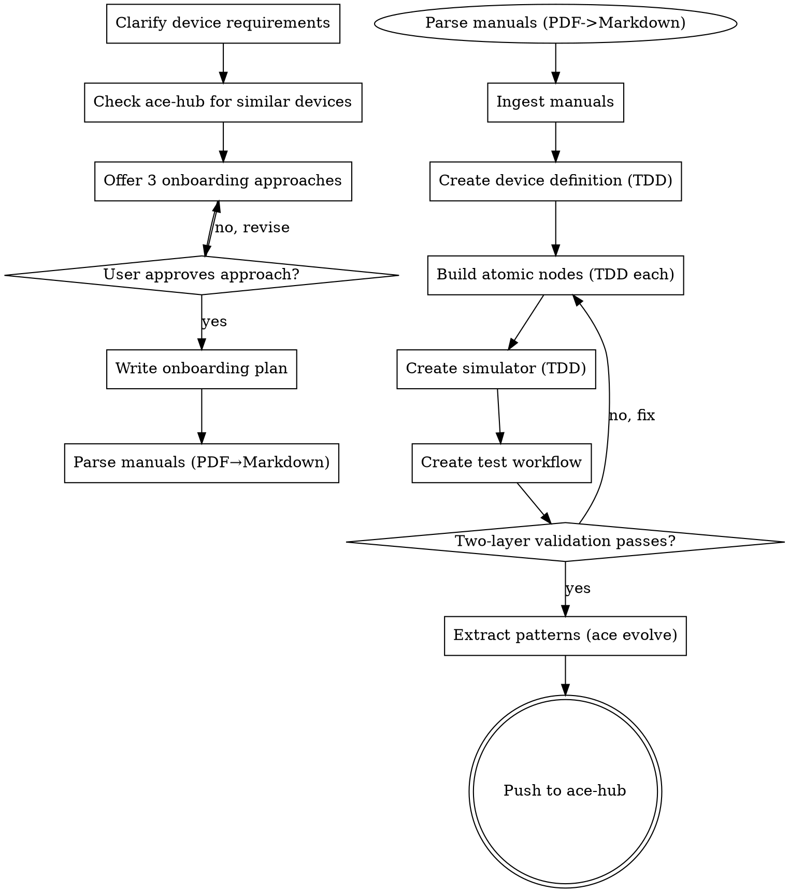

# ACE Paradigm 2 - Device & Simulator Onboarding

Transform device manuals and SDKs into ACE-orchestratable assets with ace-hub sharing.

## When to Use

- User brings new instrument/device manuals
- User provides SDK/API with examples
- Need to create Device + Simulator definitions
- No existing abstraction for target device
- Want to share device configuration with team via ace-hub

## Anti-Pattern: "Skip Clarify and Start Building"

Every device onboarding requires full Clarify → Design → Plan → Execute → Verify → Share cycle. Even "simple" devices have safety constraints, API quirks, and integration requirements. The design can be concise for well-understood device types, but you MUST complete all phases and get user approval before writing any device code.

## HARD-GATE: Scope Boundary — Device Adapter ONLY

**Device onboarding is ADAPTER work, NOT framework development.**

### ✅ ALLOWED — Within `~/.ace/store/` scope:
- Device definitions in `~/.ace/store/devices/<device_type>/<implementation>/`
  - Example: `devices/stm/nanonis/` (hardware) or `devices/stm/simulator/` (simulator)
- Node implementations in `~/.ace/store/nodes/atomic/<node_id>/`
- Workflows in `~/.ace/store/workflows/`
- Device-specific SKILL.md and memory
- Pushing to ace-hub via `ace hub push`

### ❌ FORBIDDEN — NEVER modify ACE core:
- **NEVER** modify `/data/codes/ace/src/core/` or any framework code
- **NEVER** modify `/data/codes/ace/ace/` CLI commands
- **NEVER** modify `/data/codes/ace/evolution/`, `/data/codes/ace/composition/`, `/data/codes/ace/workflow/`
- **NEVER** modify any files outside `~/.ace/store/` or ace-hub data repo

### Violation Protocol

If you find yourself wanting to:
- "Fix" core framework code → STOP. Work around it in your device adapter.
- "Add" a feature to ACE CLI → STOP. Use existing CLI commands only.
- "Refactor" shared infrastructure → STOP. This is device onboarding, not framework dev.

**Device onboarding ONLY creates adapter layers. Framework improvements require `ace-development` paradigm, not this skill.**

## Checklist

You MUST create a task for each of these items and complete them in order:

1. **Clarify device requirements** — model, vendor, manuals, SDKs, safety constraints
2. **Check ace-hub for similar devices** — `ace hub list --type devices`
3. **Offer 3 onboarding approaches** — Full Sim / HITL / Hybrid with trade-offs
4. **Get user approval on approach** — wait for explicit confirmation
5. **Write onboarding plan** — invoke `superpowers:writing-plans`
6. **Parse manuals (PDF→Markdown)** — use `pdf-to-markdown` skill
7. **Ingest manuals** — `ace knowledge ingest <manual.md>`
8. **Create device definition (TDD)** — test first, then `ace device create`
9. **Build atomic nodes (TDD each)** — RED: test → GREEN: code → REFACTOR: clean
10. **Create simulator (TDD)** — test first, then `ace simulator create`
11. **Create test workflow** — validate all nodes end-to-end
12. **Verify with two-layer validation** — unit tests + workflow integration
13. **Extract patterns** — `ace evolve` for future onboardings
14. **Push to ace-hub** — `ace hub push <id> --type device --commit`

## Process Flow



**The terminal state is pushing to ace-hub.** Do NOT skip validation or evolution phases. All nodes must pass both unit tests AND workflow integration tests before sharing.

## Key Principles

**From Superpowers:**
- Clarify before building (one question at a time)
- Design alternatives (propose 2-3 approaches)
- Verify at each milestone
- No speculative work
- **TDD is mandatory**: NO NODE/SIMULATOR CODE WITHOUT FAILING TEST FIRST
- Write test → watch it fail → write minimal code → watch it pass
- Validate with: node test + simple workflow end-to-end test

**From ACE:**
- Accumulate: Onboarding process → traces
- Composable: Device + Simulator + Nodes work together
- Evolve: Device onboarding patterns feed future onboardings
- Share: Push to ace-hub for team collaboration

## 6-Phase Workflow

### Phase 1: Clarify

Ask one question at a time:
1. What device/instrument? (model, vendor)
2. What manuals/documentation available? (PDFs, API docs)
3. What SDK/API available? (Python package, REST API, etc.)
4. What's the goal? (Full automation, HITL, or future capability?)
5. Any safety constraints or dangerous operations?

**If user mentions device but no manual provided:**
> "To onboard this device properly, I'll need the device manual or documentation. Can you provide:
> - User manual PDF
> - API documentation
> - SDK guides
> - Any other technical documentation"

**CLI Check:**
```bash
# Check if similar device exists on ace-hub
ace hub list --type devices
ace hub list --type devices --filter <vendor>
```

### Phase 2: Design

**Invoke superpowers:brainstorming**

Propose 3 onboarding approaches:

**Option A: Full Simulator + Automation**
- Build complete simulator from SDK
- Full workflow automation
- Best for: Well-understood, safe operations

**Option B: HITL (Human-in-the-loop) with Traces**
- Human executes, ACE learns
- Accumulate traces for future automation
- Best for: Complex, safety-critical operations

**Option C: Hybrid**
- Simulator for safe operations
- HITL for high-risk operations
- Best for: Mixed safety requirements

**Reference existing devices:**
```bash
# Pull reference device for design inspiration
ace hub pull <similar-device> --type device
```

Get user approval before proceeding.

### Phase 3: Plan

**Invoke superpowers:writing-plans**

Create detailed onboarding plan with:
- Step-by-step CLI commands
- File paths for all artifacts
- Validation checkpoints
- Estimated time for each step

**Parse and Ingest Manuals:**

**If user provides PDF manual, first parse to Markdown:**

Use the `pdf-to-markdown` skill to convert the manual:

```python
from skills.pdf_to_markdown import convert_pdf_to_markdown

md_path = convert_pdf_to_markdown(
    pdf_path='<manual.pdf>',
    title='<Device> User Manual',
    languages='chi_sim+eng'  # Adjust based on manual language
)
print(f'✓ Manual converted: {md_path}')
```

Or via CLI:
```bash
python3 -c "
from skills.pdf_to_markdown import convert_pdf_to_markdown
md_path = convert_pdf_to_markdown('<manual.pdf>', title='<Device> User Manual')
print(f'Parsed: {md_path}')
"
```

**Then ingest for ACE:**
```bash
ace knowledge ingest <manual.md> --tags device:<device-id>
```

**Note:** If user mentions a device but hasn't provided a manual:
> "To onboard this device, I'll need the device manual or documentation. Can you provide:
> - User manual PDF
> - API documentation
> - SDK guides
> - Any other technical documentation"

### Phase 4: Execute with TDD

**CRITICAL: Apply TDD to all code artifacts**

**TDD Iron Law: NO NODE/SIMULATOR CODE WITHOUT FAILING TEST FIRST**

**1. Create Device Definition:**
```bash
ace device create <device-id> --from-spec device_spec.json
```

**2. Build Atomic Nodes (TDD for each):**

For each atomic operation - TDD cycle:

**RED - Write Failing Test:**
```bash
# Create test FIRST - node doesn't exist yet
ace node test --create <node-id>_test.py --description "connect to device"
# Verify test FAILS (expected - node not implemented)
ace sandbox test <node-id>_test.py
```

**GREEN - Build Node to Pass Test:**
```bash
# Build node to make test pass
ace node build --device <device-id> --description "connect to device"
# Verify test PASSES
ace sandbox test <node-id>_test.py
```

**REFACTOR - Clean Up:**
```bash
# Improve node while test stays green
ace node validate <node-id>
ace sandbox test <node-id>_test.py  # Must still pass
```

**Repeat for each node:**
```bash
# RED
ace node test --create <node-id>_test.py --description "set parameter X"
ace sandbox test <node-id>_test.py  # Must fail

# GREEN
ace node build --device <device-id> --description "set parameter X"
ace sandbox test <node-id>_test.py  # Must pass
```

**3. Create Simulator (if applicable, TDD):**

**RED:**
```bash
ace simulator test --create <device-id>_sim_test.py
ace sandbox test <device-id>_sim_test.py  # Must fail
```

**GREEN:**
```bash
ace simulator create <device-id> [--type <sim-type>]
ace sandbox test <device-id>_sim_test.py  # Must pass
```

**4. Create Test Workflow (TDD):**

**RED - Create failing test workflow:**
```bash
# Create test workflow (will fail since nodes might not be fully integrated)
ace workflow create --device <device-id> --name "test_<device-id>" --nodes "<node1>,<node2>,..."
ace run workflow test_<device-id> --dry-run  # Should fail or show issues
```

**GREEN - Fix nodes until workflow passes:**
```bash
# Iterate on nodes until test workflow passes
ace run workflow test_<device-id>  # Must pass end-to-end
```

**TDD Iron Law: NO NODE/SIMULATOR CODE WITHOUT FAILING TEST FIRST**

### Phase 5: Verify

**Invoke superpowers:verification-before-completion**

**Two-layer validation: Node tests + End-to-end workflow test**

**Layer 1: Validate individual artifacts:**
```bash
# Validate device
ace device validate <device-id>

# Validate nodes (unit test level)
ace node validate <node-id-1>
ace sandbox test <node-id-1>_test.py

ace node validate <node-id-2>
ace sandbox test <node-id-2>_test.py
# ... etc

# Test simulator
ace simulator test <device-id>
```

**Layer 2: Validate with simple test workflow (end-to-end):**
```bash
# Create minimal test workflow chaining all nodes
ace workflow create --device <device-id> --name "test_<device-id>" --nodes "<node1>,<node2>,..."

# Dry-run first
ace run workflow test_<device-id> --dry-run

# Full test workflow execution
ace run workflow test_<device-id>

# All nodes must pass both unit test AND workflow integration test
```

### Phase 6: Evolution & Sharing

**1. Extract Patterns:**
```bash
ace evolve
```

**2. Push to ace-hub for sharing:**
```bash
# Push device with memory
ace hub push <device-id> --type device --commit

# Push nodes
ace hub push <node-id> --type node

# Push workflows
ace hub push <workflow-id> --type workflow --commit
```

**3. Document in CLAUDE.md (if universal patterns emerge)**

## Reference Templates

**Device adapter layer is thin. Implementation complexity lives in nodes.**

### Device Definition — Standard Pattern

**`device.json`** — Thin capability contract, NOT implementation:

```json
{
  "name": "<device-type>/<implementation>",
  "type": "<DEVICE_TYPE>",
  "vendor": "<Vendor Name>",
  "model": "<Model Name>",
  "version": "1.0.0",
  "description": "Brief description of the device",
  "capabilities": [
    "capability_1",
    "capability_2",
    "capability_3"
  ],
  "parameters": {
    "param_group_1": {
      "range": [min, max],
      "presets": ["preset1", "preset2"]
    },
    "param_group_2": {
      "options": ["option1", "option2"]
    }
  },
  "connection": {
    "protocol": "tcp|serial|rest|...",
    "host": "127.0.0.1",
    "port": 50000,
    "authkey": "optional_auth_key"
  },
  "has_simulator": true,
  "simulator_id": "<device-id>-simulator",
  "simulator": {
    "source": "local",
    "simulator_id": "<device-id>-simulator",
    "speed_multiplier": 10.0
  },
  "metadata": {
    "simulator_class": "<DeviceName>Simulator",
    "sdk_install": {
      "method": "pip|local",
      "package": "git+ssh://... OR /local/path/to/sdk"
    }
  }
}
```

**Key Principles:**
- `device.json` is a **capability declaration**, not implementation code
- Implementation details go in **nodes**, referenced by capabilities
- SDK configuration in `metadata.sdk_install` (pip URL or local path)
- Simulator class name in `metadata.simulator_class` (matches device.py)

### Device Simulator — Standard Pattern

**`device.py`** — Thin adapter extending `SimulatorDevice`:

```python
"""
<Device Name> Simulator Implementation
Reference: FIB-SEM Simulator Implementation Pattern
"""
import asyncio
import datetime
import logging
import time
from copy import deepcopy
from typing import Any, Dict, List, Optional

import numpy as np

import sys
import os
from pathlib import Path
ace_root = os.environ.get("ACE_ROOT", str(Path(__file__).parent.parent.parent.parent.parent.parent.parent))
sys.path.insert(0, str(ace_root))

from src.core.simulator.base import DeviceState, OperationResult, SimulatorDevice

logger = logging.getLogger(__name__)


class <DeviceName>Simulator(SimulatorDevice):
    """
    <Device Name> Simulator

    Thin adapter layer:
    - Defines default state schema
    - Implements operation handlers
    - Delegates complex logic to nodes
    """

    _DEFAULT_STATE: Dict[str, Any] = {
        "subsystem_1": {"param1": default_value, "param2": default_value},
        "subsystem_2": {"param3": default_value},
        "status": "idle",
    }

    def __init__(self, simulator_id: str = "<device-id>-simulator", speed_multiplier: float = 10.0):
        super().__init__(simulator_id=simulator_id, device_type="<DEVICE_TYPE>")
        self._speed_multiplier = max(speed_multiplier, 0.1)
        self._faults: Dict[str, float] = {}

    @property
    def vendor(self) -> str:
        return "<Vendor Name>"

    @property
    def model(self) -> str:
        return "<Model Name>"

    @property
    def description(self) -> str:
        return "<Device> Simulator"

    @property
    def capabilities(self) -> List[str]:
        return [
            "capability_1",
            "capability_2",
            "capability_3",
        ]

    def connect(self) -> None:
        """Initialize simulator state."""
        self._state = DeviceState(
            timestamp=datetime.datetime.now(datetime.timezone.utc).isoformat(),
            properties=deepcopy(self._DEFAULT_STATE),
        )
        self._connected = True
        self._faults = {}
        logger.info(f"<Device> simulator connected: session={self.session_id}")

    def disconnect(self) -> None:
        """Clean up simulator state."""
        self._connected = False
        logger.info(f"<Device> simulator disconnected: session={self.session_id}")

    def inject_fault(self, fault_type: str, severity: float = 0.5) -> None:
        """Inject fault for testing (optional)."""
        valid_faults = {"fault_type_1", "fault_type_2"}
        if fault_type not in valid_faults:
            logger.warning(f"Unknown fault type: {fault_type}")
            return
        self._faults[fault_type] = max(0.0, min(1.0, severity))

    def remove_fault(self, fault_type: str) -> None:
        """Remove injected fault (optional)."""
        self._faults.pop(fault_type, None)

    def set_speed_multiplier(self, value: float) -> None:
        """Adjust simulation speed (optional)."""
        self._speed_multiplier = max(value, 0.1)

    def get_speed_multiplier(self) -> float:
        return self._speed_multiplier

    async def execute_operation(self, operation: str, params: Dict[str, Any]) -> OperationResult:
        """
        Route operation to handler.
        Handler naming: _op_<operation_name>
        """
        start_time = time.time()
        try:
            handler = getattr(self, f"_op_{operation}", None)
            if handler is None:
                return OperationResult(
                    success=False, operation=operation,
                    error=f"Unknown operation: {operation}",
                    duration_seconds=time.time() - start_time,
                )
            result = await handler(params)
            result.duration_seconds = time.time() - start_time
            return result
        except Exception as e:
            return OperationResult(
                success=False, operation=operation, error=str(e),
                duration_seconds=time.time() - start_time,
            )

    # --- Operation Handlers ---
    # Each handler is thin - complex logic goes in nodes

    async def _op_connect(self, params: Dict[str, Any]) -> OperationResult:
        """Handle connect operation."""
        self.connect()
        return OperationResult(success=True, operation="connect")

    async def _op_disconnect(self, params: Dict[str, Any]) -> OperationResult:
        """Handle disconnect operation."""
        self.disconnect()
        return OperationResult(success=True, operation="disconnect")

    async def _op_get_state(self, params: Dict[str, Any]) -> OperationResult:
        """Return current device state."""
        return OperationResult(
            success=True,
            operation="get_state",
            data={"state": self._state.properties if self._state else {}}
        )

    async def _op_set_parameter(self, params: Dict[str, Any]) -> OperationResult:
        """
        Set device parameter.
        Validation logic should be in node, this just applies.
        """
        subsystem = params.get("subsystem")
        param = params.get("parameter")
        value = params.get("value")

        if not all([subsystem, param, value is not None]):
            return OperationResult(
                success=False,
                operation="set_parameter",
                error="Missing subsystem, parameter, or value"
            )

        if self._state and subsystem in self._state.properties:
            self._state.properties[subsystem][param] = value
            return OperationResult(success=True, operation="set_parameter")

        return OperationResult(
            success=False,
            operation="set_parameter",
            error=f"Invalid subsystem: {subsystem}"
        )

    # Add more operation handlers as needed...
    # Each should be THIN - just state updates and basic validation
```

**Key Principles:**
- `device.py` is a **thin adapter** extending `SimulatorDevice`
- State schema defined in `_DEFAULT_STATE`
- Operation handlers route to `_op_<operation>` methods
- **Keep handlers thin** — complex validation/encoding goes in nodes
- Fault injection optional but recommended for testing
- Reference `FIBSEMSimulator` for complete implementation pattern

### Scope Reminder

**Hierarchy:** `devices/<device_type>/<implementation>/`
- Example: `devices/stm/nanonis/` (hardware), `devices/stm/simulator/` (simulator)

| Layer | Content | Location |
|-------|---------|----------|
| Device definition | Capability contract, SDK config | `device.json` (in `<type>/<impl>/`) |
| Simulator adapter | State management, operation routing | `device.py` (in `<type>/simulator/`) |
| Operation logic | Complex validation, protocol encoding | **Nodes** |
| SDK integration | Device-specific API calls | **Nodes** |

**Device adapter is thin. Implementation complexity lives in nodes.**

## Deliverables

| Artifact | Location | Hub Path | Purpose |
|----------|----------|----------|---------|
| Device definition | `~/.ace/store/devices/<type>/<impl>/` | `ace-hub/devices/<type>/<impl>/` | Capability contract |
| SKILL.md | `~/.ace/store/devices/<type>/<impl>/SKILL.md` | `ace-hub/devices/<type>/<impl>/SKILL.md` | API documentation |
| Simulator | `~/.ace/store/devices/<type>/simulator/` | `ace-hub/devices/<type>/simulator/` | Testing & validation |
| Atomic nodes | `~/.ace/store/nodes/atomic/<node_id>/` | `ace-hub/nodes/<node_id>/` | Reusable operations |
| Workflows | `~/.ace/store/workflows/<workflow_id>.json` | `ace-hub/workflows/<workflow_id>/` | Ready-to-run workflows |
| Memory | `~/.ace/store/devices/<type>/<impl>/memory/` | `ace-hub/devices/<type>/<impl>/memory/` | Device-specific data |
| Insights | `~/.ace/insights/device-<type>*.md` | - | Patterns for future |

## Interaction Flow Example

**User:** "I need to onboard a new TEM instrument."

**Agent:** "I'll help you onboard the TEM. Let me start by clarifying a few things...

1. What specific TEM model are you working with?"

**User:** "It's a JEOL JEM-ARM200F."

**Agent:** "Got it. Let me check ace-hub for similar devices...
```bash
ace hub list --type devices --filter JEOL
```
[Shows results or 'No matches found']

What manuals or documentation do you have available?"

**User:** "I have the user manual PDF and a Python SDK from JEOL."

**Agent:** "Great. What's your goal - full automation, human-in-the-loop, or building future capability?"

**User:** "We want to automate sample screening workflows."

**Agent:** "Any safety constraints or dangerous operations I should know about?"

**User:** "High voltage operations and beam alignment need careful handling."

**Agent:** "Understood. Based on this, I propose 3 onboarding approaches:

[Option A, B, C as described in Phase 2]

Which approach fits your needs?"

**User:** "Option C - hybrid approach."

**Agent:** "Perfect. Starting with Option C - Hybrid approach.

**Phase 3: Plan**

Let me create a detailed onboarding plan and parse the manual...

First, let me parse the PDF manual to Markdown:
```bash
python3 -c "
from skills.pdf_to_markdown import convert_pdf_to_markdown
md_path = convert_pdf_to_markdown('JEOL_JEM-ARM200F_manual.pdf', title='JEOL JEM-ARM200F User Manual')
print(f'Parsed: {md_path}')
"
```

Now ingesting the parsed manual:
```bash
ace knowledge ingest JEOL_JEM-ARM200F_manual.md --tags device:jeol-jem-arm200f
```

[Continues through phases with specific CLI commands...]

## Canonical Statements

- "Before onboarding, let me check ace-hub for similar devices..."
- "To onboard this device, I'll need the device manual. Can you provide the PDF?"
- "Converting PDF manual to Markdown using pdf-to-markdown skill..."
- "Parsing manual PDF to Markdown using OCR..."
- "Proposing 3 onboarding approaches (Full Sim / HITL / Hybrid)..."
- "Ingesting manuals: ace knowledge ingest..."
- "TDD: NO NODE CODE WITHOUT FAILING TEST FIRST"
- "RED: Writing failing test for node..."
- "GREEN: Building node to pass test..."
- "REFACTOR: Cleaning up while tests green..."
- "Validating: node unit test + simple workflow end-to-end test"
- "Running ace evolve to extract patterns..."
- "Pushing to ace-hub: ace hub push <id> --type device --commit"

## TDD Red Flags - STOP and Delete

- Node code written before test → Delete and start over with TDD
- Test passes immediately → Fix test, must fail first
- "Simulator too simple to test" → Test it anyway
- "I'll add tests after onboarding" → No. Test-first NOW
- "Node passes unit test but fails workflow" → Fix node until both pass
